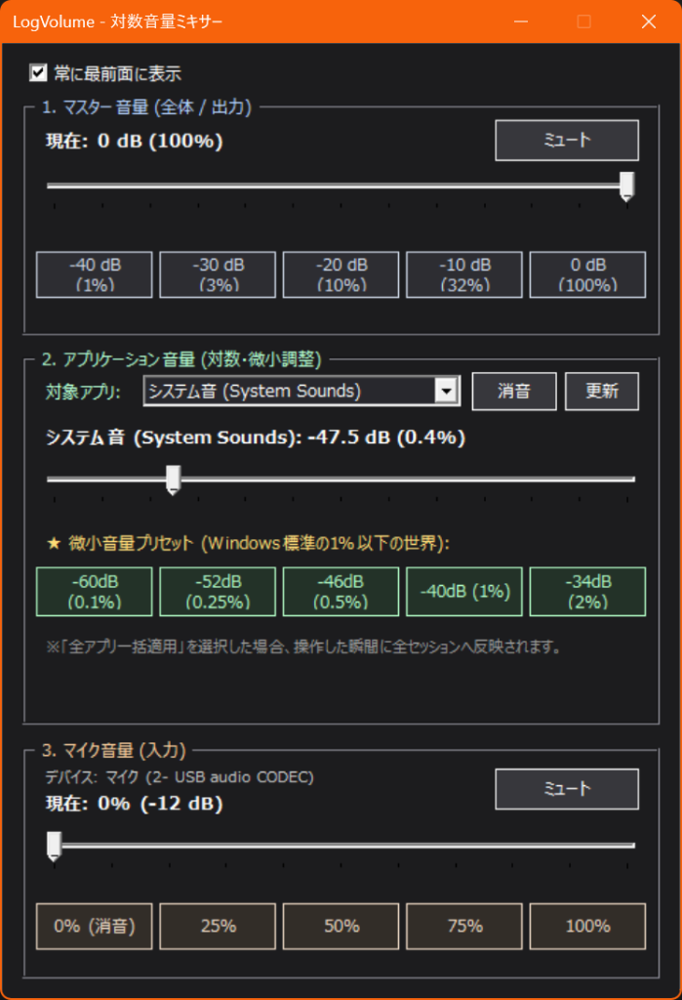

# LogVolume 🔊

Windows 向け **対数音量ミキサー (Logarithmic Volume Mixer)**

「イヤホンや外付けアンプを使っていて、Windows 標準の音量 1% でも音が大きすぎる……」  
「ゲームや配信、通話中に、もっと細かく微小な音量を調整したい」  
「マイクの音量調整やワンクリック消音を手元で素早く行いたい」  
「USBマイク等のサイドトーン（ダイレクトモニタリング）音量を手軽に調整したい」

そんなニーズに応えるために設計された、軽量・ポータブルな Windows 用オーディオ調整ツールです。

---

## 主な特徴

### 1. 🔊 マスター音量 (スピーカー / 全体出力)
- **dB（デシベル）単位の精密な対数コントロール**:
  - 人間の聴覚特性（対数スケール）に合わせ、`-60.0 dB` 〜 `0.0 dB`（0.5 dB 刻み）で直感的に調整可能。
- **ワンクリック消音（ミュート）**:
  - 現在の状態（消音中／通常）を色と文字で分かりやすく表示。
- **クイックプリセット**:
  - `-40 dB (1%)`, `-30 dB (3%)`, `-20 dB (10%)`, `-10 dB (32%)`, `0 dB (100%)`

### 2. 🎚️ アプリケーション音量 (微小音量・対数調整)
- **Windows 標準の 1% 未満の世界をコントロール**:
  - 一般的な音量ミキサーでは操作が難しい極小音量を dB 単位で精密調整。
- **微小音量プリセット**:
  - `★ -60 dB (0.1%)`
  - `★ -52 dB (0.25%)`
  - `★ -46 dB (0.5%)`
  - `★ -40 dB (1%)`
  - `★ -34 dB (2%)`
- **全アプリ一括適用モード（起動時デフォルト）＆ 設定の自動保存**:
  - 起動時のデフォルトとして「全アプリ一括適用」が選択され、起動中のすべてのアプリケーション音量をまとめて一度に設定可能。
  - 設定したアプリ音量や消音状態、最前面表示フラグは `%APPDATA%\LogVolume\settings.json` に自動保存され、次回起動時にも微小音量設定（初期値: -34 dB / 2%）が確実に引き継がれます（起動時に 100% で爆音になる心配はありません）。
- **新着アプリの自動検知＆即時音量適用**:
  - バックグラウンドで定期監視を行い、新しく起動されたゲームやブラウザ等の音声セッションを自動検知。設定した音量を即座に自動適用するため、Windows 特有の「新しく起動したゲームが爆音（100%）で鳴る」ストレスを完全に防止。
- **アプリ個別消音**:
  - ブラウザやゲームなど、特定のアプリだけをワンクリックで消音。
- **ウィンドウタイトル優先表示**:
  - 再生中の動画タイトルやゲームタイトルを取得して表示するため、どのアプリの音かが一目瞭然。

### 3. 🎤 マイク音量 (入力 / キャプチャ)
- **マイクデバイスの自動認識**:
  - 規定のマイクデバイス名（例: `マイク (USB audio CODEC)`）を自動取得して表示。未接続時は安全に自動無効化。
- **マイク専用の消音切替ボタン**:
  - 通話や配信時に手元で瞬時にマイクをミュート／解除可能（消音中は赤色表示）。
- **音量 % および dB（ブースト値）のリアルタイム表示**:
  - `0 %` 〜 `100 %` スライダーに加え、ハードウェアの dB 値（ブースト量）を併記。
- **クイックプリセット**:
  - `0% (消音)`, `25%`, `50%`, `75%`, `100%`

### 4. 🎧 サイドトーン (ダイレクトモニタリング / ハードウェアミキサー)
- **ハードウェア側サイドトーンの直接操作**:
  - Windows の「スピーカーのプロパティ」>「レベル」タブ奥深くに隠れているダイレクトモニタリング用「マイク」音量・ミュートを本アプリから直接操作可能。
- **WASAPI DeviceTopology API によるネイティブ制御**:
  - エンドポイントトポロジからハードウェアアダプタートポロジを走査し、内部の KS Subunit をピンポイントで制御。
- **スライダー & クイックプリセット**:
  - `-60 dB` 〜 `0 dB` のスライダー調整および `消音`, `25%`, `50%`, `75%`, `100%` プリセット。
- **ミュート切り替え**:
  - モニター音のみをワンクリックでミュート可能。
- **自動認識 & グレーアウト**:
  - 対象デバイス（`USB audio CODEC`）が接続されている場合のみ有効化。

### 5. 📊 リアルタイム・オーディオピークメーター (レベルメーター)
- **聴感に即した対数（dB）スケールメーター（マスター＆アプリ音量）**:
  - 本ツールの最大の特徴である「微小音量（Windows標準の1%未満）」を視覚的にも的確に把握できるよう、**マスター音量およびアプリケーション音量のメーターに対数（dB）スケール（`-60 dB` 〜 `0 dB`）を採用**。
  - `-40 dB` や `-50 dB` などの極小音量でもしっかりと LED セグメントが振れ、実際の耳で聴こえる音の強弱・ダイナミクスと完全に一致した直感的なモニタリングが可能です。
  - メーター直下にはプリセットやスライダー値と完全に連動した主要目盛り（`-60`, `-40`, `-30`, `-20`, `-10`, `0 dB`）および 5 dB 刻みの補助目盛り（ノッチ）を配置。
- **個別アプリセッションの正確なピーク測定**:
  - ドロップダウンで選択されたアプリケーション固有の音声ピークを独立して測定。「全アプリ一括適用」選択時は、アクティブに音声を再生しているアプリセッション群の最大ピーク値を追従します。
- **マイク入力メーター（% スケール）**:
  - マイク入力には、スライダーやプリセット（0%〜100%）に合わせた分かりやすいパーセンテージスケール（`0%`, `25%`, `50%`, `75%`, `100%`）のレベルメーターを搭載。
- **36 セグメント LED カラー表示**:
  - 緑（適正・通常音量）→ 黄（高音量・適正ピーク）→ 赤（クリッピング警戒）。消灯時はアクリルパネル風の薄暗いセグメント輪郭が表示され、本格的なスタジオオーディオ機器の質感を演出。
- **滑らかなピークディケイ（減衰）アニメーション**:
  - 音声の急激なアタック（瞬間最大音量）に瞬時に追従し、自然で滑らかな減衰カーブ（約 50 dB/秒）を描いてフォールオフ。
- **超軽量動作（約 30 FPS）**:
  - Windows 標準の `IAudioMeterInformation` API を直接ポーリング。完全ダブルバッファリング描画によりチラつきゼロ、CPU負荷ほぼ 0% で滑らかに動作します。

### 6. 🔄 外部音量変更の自動同期
- タスクバーやキーボードの音量ホットキー、Windows サウンド設定、Discord などの通話アプリ側で音量・ミュートが変更されても、タイマー監視によりツール側の UI にリアルタイムで追従します。

### 7. 🎨 Windows テーマ連動 (ライト / ダークテーマ自動切替)
- Windows のレジストリ設定（`AppsUseLightTheme` / `SystemUsesLightTheme`）を起動時に検知し、OS の設定に合わせた最適な背景色・文字色・ボタンスタイルを自動適用。視認性とコントラストに配慮した配色設計です。

### 8. 🪟 コンパクト & 最前面表示
- 「常に最前面に表示」チェックボックスにより、フルスクリーンゲームや作業用ウィンドウの手前に常駐可能。
- 余分な余白を排除したタイトで無駄のないレイアウト。

---

## 動作要件

- **OS**: Windows 10 / Windows 11 (64-bit)
- **環境**: PowerShell 5.1 または PowerShell 7+（Windows 標準搭載）
- **追加インストール不要**: .NET Framework / Windows Core Audio API（ネイティブ COM）を使用しているため、外部 DLL や追加ランタイムは一切不要です。

---

## スクリーンショット



---

## 使い方

1. 本リポジトリをダウンロード（または `git clone`）。
2. **`LogVolume.bat`** をダブルクリックして実行します。
   - コンソール画面を出さずにバックグラウンドで起動します。
   - スタートアップやタスクバーにショートカットを作成しておくと便利です。

---

## なぜ「対数音量」なのか？

人間の耳が感じる音の大きさ（ラウドネス）は、物理的な音圧（リニア比）に対して**対数的**に変化します（ウェーバー・フェヒナーの法則）。

Windows 標準の音量スライダー（0〜100%）はリニアに近いカーブを描くため、高感度なイヤホンやヘッドホンアンプを使用している場合：
- **「0% だと無音だが、1% にしただけで急激に大きくなる」**
- **「夜間に小さな音で聴きたいのに、微調整が効かない」**

といった問題が起こります。

`LogVolume` では、デシベル（dB）スケールによる対数計算を行うことで、**1% 未満の超微小領域（0.1% 〜 1%）** でも滑らかで快適な音量コントロールを実現しています。

---

## ファイル構成

```text
LogVolume/
├── LICENSE         # MIT License
├── LogVolume.bat   # 起動用バッチスクリプト (-NoProfile, -STA 指定)
├── LogVolume.ps1   # メインスクリプト (WinForms UI & Core Audio COM 実装)
├── README.md       # 本ドキュメント
└── screenshot.png  # アプリケーションスクリーンショット
```

---

## ライセンス

本プロジェクトは [MIT License](LICENSE) のもとで公開されています。自由にご利用・改変いただけます。
